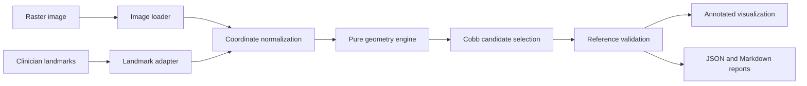

# Version 1A architecture

The domain model is the central contract. Loaders translate external data into it; geometry accepts
only the domain model; visualization consumes, but never calculates, a measurement. This boundary
lets a future landmark detector produce the same `StudyLandmarks` object without changing Version
1A geometry.

## Module responsibilities

- `dataset`: decodes images and external annotations; no angle logic.
- `domain.py`: immutable data contracts and coordinate conversion.
- `geometry`: constructs endplates and computes deterministic angles; no I/O.
- `visualization`: draws already-computed results; no business rules.
- `reports`: serializes auditable results; no calculation.
- `pipeline.py`: composition and operational logging.
- `cli.py`: command-line parsing only.

## Error policy

Invalid inputs stop analysis with a specific exception. Version 1A does not impute missing points,
guess a duplicate vertebral order, ignore a zero-length line, or fabricate a reference. This keeps
data-quality failures visible.

## Future seams

- Dataset registry and manifest-driven batch processing
- DICOM adapter with photometric interpretation and metadata controls
- Clinician-selected end vertebrae and multi-curve results
- AI detector implementing the same landmark output contract
- Typed API request/response schemas wrapping the application service
- Database persistence outside the geometry module

