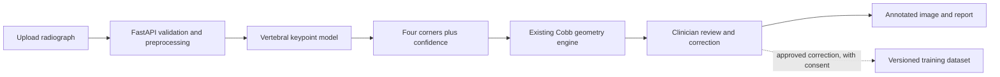

# End-to-end AI web app roadmap

> [!warning] Research use only
> This roadmap describes educational and research software. Do not present its output as a
> diagnosis or use it for treatment decisions until the complete system has appropriate clinical,
> privacy, security, and regulatory review.

## Target outcome

Build a responsive web application where a user uploads a scoliosis radiograph, a computer-vision
model predicts four corner landmarks for each visible vertebra, the existing geometry engine
calculates the Cobb angle, and a clinician can inspect and correct the landmarks before accepting
the result.

The project is successful when it demonstrates the complete AI engineering lifecycle: data
definition, annotation, training, evaluation, API inference, human review, deployment, and
monitoring.

## System boundary

> [!important] Core design decision
> The model predicts visible, editable landmarks. It does not directly guess a Cobb angle. The
> deterministic engine documented in [[Version 1A Architecture]] remains responsible for angle
> calculation.

## Proposed technical baseline

| Layer | Initial choice | Reason |
|---|---|---|
| Model training | PyTorch and Torchvision | Mature training ecosystem and a clear upgrade path |
| Baseline model | Keypoint R-CNN with ResNet-50-FPN | Detects vertebral instances and predicts four keypoints |
| Model input | De-identified full-spine radiograph | Matches the intended measurement workflow |
| Model output | Vertebra box, four ordered corners, confidence | Auditable contract already consumed by the geometry engine |
| API | FastAPI | Typed upload, inference, correction, and reporting endpoints |
| Frontend | Responsive React/Next.js or HTMX UI | Supports image overlays and drag-to-correct landmarks |
| Image support | PNG/JPEG first; DICOM after the web MVP | Reduces early complexity while preserving a DICOM path |
| Inference | PyTorch first; benchmark ONNX Runtime later | Establish correctness before optimization |
| Deployment | One Dockerized application initially | Avoids a separate model service before scale requires it |

The pretrained backbone is only a starting point. It must be fine-tuned on consistently annotated
spine radiographs before it can identify vertebral corners.

## Phase 0 — Preserve the auditable geometry foundation

**Status:** substantially complete in [[Version 1A Roadmap]].

### Deliverables

- [x] Canonical four-corner landmark contract
- [x] Deterministic endplate and Cobb-angle geometry
- [x] Annotated image and structured report output
- [x] Synthetic fixtures and automated tests
- [ ] Complete the first real-dataset adapter and reference comparison
- [ ] Obtain qualified review of annotation semantics and measurement behavior

### Exit gate

The geometry engine produces repeatable results for synthetic and reviewed real cases without any
model dependency.

### Learning focus

Domain modeling, numerical geometry, testing, reproducibility, and separating AI predictions from
business logic.

## Phase 1 — FastAPI web MVP with manual landmarks

Build the product workflow before adding uncertain model behavior.

> [!success] Foundation available
> The FastAPI application, health and capability endpoints, synthetic-analysis endpoint,
> responsive browser experience, API tests, and Docker deployment are working. Real-image upload,
> editable landmarks, and model inference remain pending.

### Deliverables

- [x] Create the FastAPI application and health endpoint
- [ ] Add validated PNG/JPEG upload with file-size and content-type limits
- [x] Run the existing geometry pipeline from a synthetic API endpoint
- [ ] Build a responsive image viewer with landmark and endplate overlays
- [ ] Let a user add, move, relabel, and delete vertebral landmarks
- [ ] Return the Cobb angle, selected end vertebrae, warnings, and downloadable report
- [ ] Add API, geometry-regression, and browser workflow tests
- [ ] Define retention and deletion behavior for uploaded images

The current browser can select and preview PNG/JPEG files locally, but it intentionally does not
transmit them. The safe synthetic workflow already returns the calculated angle, selected end
vertebrae, annotated image, and report artifacts.

### Exit gate

A user can upload an image, review or correct landmarks, and obtain a deterministic report without
an AI model.

### Learning focus

FastAPI, request validation, frontend state, image coordinates, API contracts, testing, and secure
file handling.

## Phase 2 — Annotation and dataset pipeline

Treat data quality as a product, not a one-time preprocessing script.

### Deliverables

- [ ] Select a dataset only after recording its source, license, permitted uses, and limitations in
      [[Dataset Integration Status]]
- [ ] Define one written annotation policy for corner order, visibility, vertebral level, and
      ambiguous anatomy
- [ ] Export annotations to a versioned COCO-style keypoint schema
- [ ] Record image provenance, de-identification status, exclusions, and file hashes
- [ ] Split by patient—and by site when possible—to prevent leakage
- [ ] Create training, validation, and untouched test manifests
- [ ] Measure inter-rater disagreement on a clinician-reviewed subset
- [ ] Add automated checks for missing, swapped, duplicated, and out-of-bounds points

### Exit gate

The dataset can be rebuilt deterministically, passes validation, and has documented annotation and
usage rules.

### Learning focus

Data governance, labeling systems, dataset versioning, leakage prevention, quality assurance, and
reproducible preprocessing.

## Phase 3 — Train the keypoint baseline

### Deliverables

- [ ] Fine-tune Keypoint R-CNN with a ResNet-50-FPN backbone
- [ ] Treat each vertebra as one instance with four ordered corner keypoints
- [ ] Add clinically plausible augmentation without changing anatomy or laterality incorrectly
- [ ] Track configuration, code commit, dataset version, random seed, weights, and metrics
- [ ] Save the best checkpoint by a predefined validation metric
- [ ] Generate visual error galleries, including low-confidence and failed cases
- [ ] Compare against a simple baseline rather than reporting one model in isolation
- [ ] Keep the test set sealed until model and threshold choices are frozen

### Evaluation

Measure at least:

- vertebra detection precision and recall;
- normalized keypoint error and per-corner failure rates;
- Cobb-angle mean absolute error, median error, and error distribution;
- performance by image source, curve severity, age group, visibility, and other relevant subgroups;
- confidence calibration and the rate at which the system should defer to manual review.

Acceptance thresholds must be written with a qualified clinical stakeholder before opening the
test-set results.

### Exit gate

The frozen model meets the predefined research thresholds on the untouched test set, and its common
failure modes are documented.

### Learning focus

Transfer learning, losses, augmentation, experiment tracking, evaluation design, calibration,
error analysis, and model cards.

## Phase 4 — Integrate model inference and human review

### Deliverables

- [ ] Load one explicit model version when FastAPI starts
- [ ] Convert predicted points into the canonical landmark domain model
- [ ] Reject or defer unsupported images instead of forcing a confident result
- [ ] Display confidence and warnings beside every predicted vertebra
- [ ] Preserve the unedited prediction separately from clinician corrections
- [ ] Recalculate the Cobb angle immediately after a point is moved
- [ ] Record model version, preprocessing version, and geometry version in each report
- [ ] Add regression tests from upload through final measurement
- [ ] Prevent corrected clinical data from entering training without authorization and provenance

### Exit gate

Every reported angle can be traced to the exact image, landmark set, model version, corrections,
and geometry version.

### Learning focus

Model serving, versioned interfaces, human-in-the-loop design, auditability, fallbacks, and
end-to-end testing.

## Phase 5 — Package, deploy, and operate

> [!info] Early container milestone
> The current API, browser UI, geometry engine, and synthetic fixture are packaged in one hardened
> Docker image and Docker Compose service. Model packaging, production authentication, CI/CD, and
> operational controls remain future work.

### Deliverables

- [ ] Containerize the API, frontend, geometry engine, and model artifact
- [ ] Benchmark PyTorch and ONNX Runtime on the intended CPU/GPU environment
- [ ] Add an asynchronous job queue only if measured inference latency requires it
- [ ] Add authentication, authorization, encryption, upload limits, and rate limiting
- [ ] Keep protected health information out of logs, analytics, and error traces
- [ ] Record latency, failures, deferrals, model version, and drift-safe aggregate metrics
- [ ] Add CI for tests, formatting, dependency checks, image builds, and deployment
- [ ] Document rollback, deletion, backup, incident response, and model replacement procedures

### Exit gate

A reproducible deployment passes security and reliability checks, supports rollback, and exposes no
patient data through logs or public storage.

### Learning focus

Docker, CI/CD, inference optimization, cloud deployment, observability, security, cost, and
operational ownership.

## Phase 6 — External validation and clinical-readiness research

### Deliverables

- [ ] Freeze the intended use, target users, supported image types, and exclusion criteria
- [ ] Compare the system with measurements from multiple qualified clinicians
- [ ] Validate on data from sources not used for training or model selection
- [ ] Evaluate subgroup performance and clinically important failure modes
- [ ] Run usability testing for landmark review and correction
- [ ] Document privacy, security, risk, human oversight, and regulatory obligations
- [ ] Publish a model card and system limitations
- [ ] Define post-deployment monitoring and change-control rules

### Exit gate

Independent evidence supports the stated intended use. Until then, the application remains clearly
labeled as research software.

### Learning focus

Clinical validation, responsible AI, human factors, risk management, documentation, and lifecycle
monitoring.

## First implementation slice

Work on these items next, in order:

1. [ ] Complete the real-dataset decision and annotation-semantics record.
2. [x] Define the initial FastAPI response contract around the existing landmark schema.
3. [x] Create a synthetic endpoint that runs the current non-AI pipeline.
4. [ ] Add a validated real-image upload endpoint and browser overlay with drag-to-correct points.
5. [ ] Save corrections in the canonical annotation format.
6. [ ] Add patient-level dataset manifests and validation scripts.
7. [ ] Train Keypoint R-CNN on a small verified subset as a pipeline smoke test.
8. [ ] Review its visual predictions before scaling training.
9. [ ] Freeze evaluation rules, then train and evaluate the baseline.
10. [ ] Integrate the versioned model only after the web and data contracts are stable.

## MVP definition

The first AI-enabled MVP is complete when:

- an authorized user can upload a supported, de-identified radiograph;
- the model returns vertebral boxes, four corner points, and confidence values;
- the geometry engine calculates and visualizes the Cobb angle;
- the user can correct every point before accepting the result;
- the report records inputs, corrections, warnings, and component versions;
- automated tests cover the critical upload-to-report path;
- the interface clearly states that the system is not clinically validated.

## Explicit non-goals for the first AI MVP

- autonomous diagnosis or treatment recommendations;
- direct image-to-angle black-box regression;
- automatic ingestion from hospital PACS;
- mobile applications;
- exercise coaching or patient-facing recommendations;
- silent reuse of uploaded medical images for training;
- high-scale microservices before measured demand requires them.

## Open decisions

- [ ] Which dataset can legally and practically support the first training baseline?
- [ ] Who defines and reviews the landmark annotation protocol?
- [ ] Should vertebral levels be predicted as classes or assigned by a reviewed ordering step?
- [ ] What confidence rule triggers mandatory manual measurement?
- [ ] Which Cobb-angle and landmark-error thresholds define research success?
- [ ] Which deployment environment meets the project's privacy and security requirements?
- [ ] When should DICOM support become mandatory?

## Related notes

- [[Project Home]]
- [[Product Vision]]
- [[Version 1A Roadmap]]
- [[Version 1A Architecture]]
- [[Dataset Integration Status]]
- [[Cobb Angle Basics]]
- [[Version 1A TODO]]

## Primary technical references

- [Torchvision Keypoint R-CNN](https://docs.pytorch.org/vision/master/models/keypoint_rcnn.html)
- [FastAPI documentation](https://fastapi.tiangolo.com/)
- [MONAI medical imaging framework](https://project-monai.github.io/MONAI/)
- [pydicom documentation](https://pydicom.github.io/pydicom/stable/)
- [ONNX Runtime documentation](https://onnxruntime.ai/docs/)
- [FDA Good Machine Learning Practice](https://www.fda.gov/medical-devices/software-medical-device-samd/good-machine-learning-practice-medical-device-development-guiding-principles)
