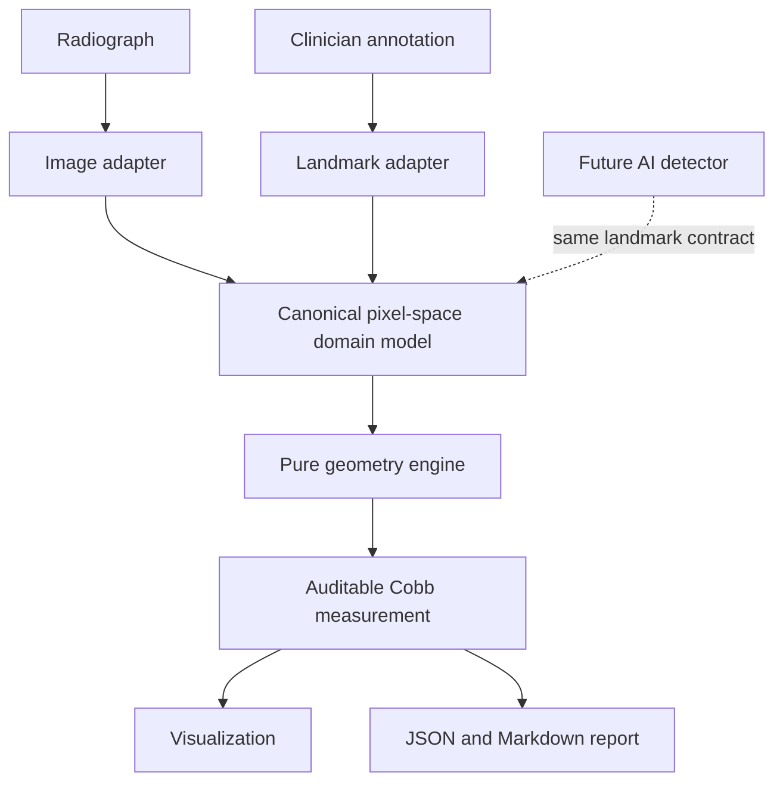

# Version 1A architecture

```mermaid
flowchart TD
    A["Radiograph"] --> B["Image adapter"]
    C["Clinician annotation"] --> D["Landmark adapter"]
    B --> E["Canonical pixel-space domain model"]
    D --> E
    E --> F["Pure geometry engine"]
    F --> G["Auditable Cobb measurement"]
    G --> H["Visualization"]
    G --> I["JSON and Markdown report"]
    J["Future AI detector"] -. "same landmark contract" .-> E
```

See the repository's `docs/architecture.md` for module responsibilities and [[ADR-001 Canonical
Landmark Domain Model]] for the boundary rationale.

